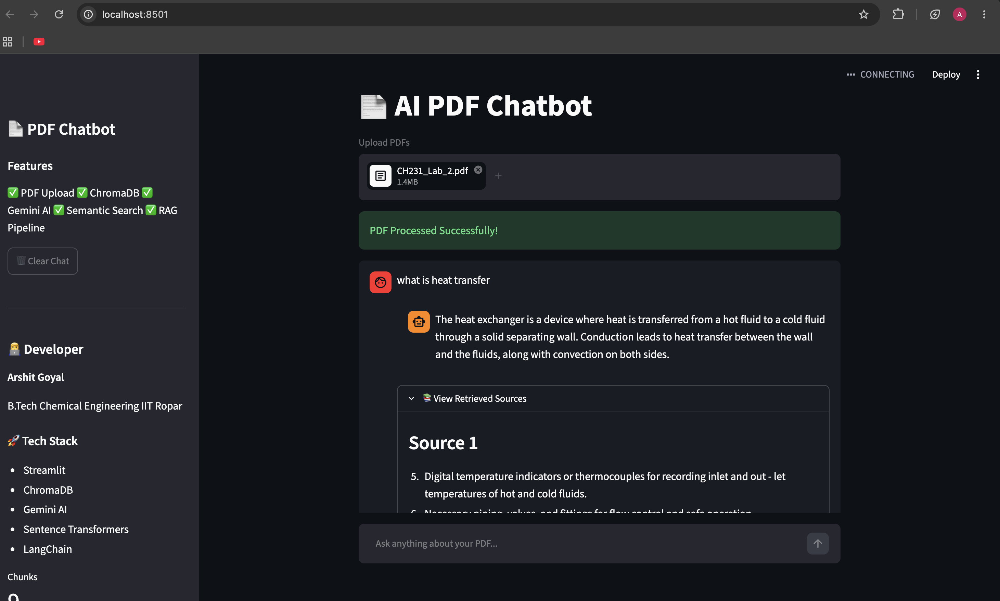

# AI PDF Chatbot

An AI-powered PDF Question Answering system built using Streamlit, ChromaDB, Sentence Transformers, and Ollama.

## Demo




## Features

* Upload PDF documents
* Automatic text chunking
* Vector embeddings using Sentence Transformers
* Semantic search with ChromaDB
* Retrieval-Augmented Generation (RAG)
* Local LLM inference using Ollama
* Chat-style interface
* Chat history support

## Tech Stack

* Python
* Streamlit
* ChromaDB
* Sentence Transformers
* LangChain
* Ollama
* Gemma

## Installation

Clone the repository:

```bash
git clone https://github.com/arshit-0101/ai-pdf-chatbot.git
cd ai-pdf-chatbot
```

Install dependencies:

```bash
pip install -r requirements.txt
```

Start Ollama:

```bash
ollama serve
```

Pull the model:

```bash
ollama pull gemma3:4b
```

Run the application:

```bash
streamlit run app.py
```

## Project Workflow

1. Upload PDF
2. Extract text
3. Split into chunks
4. Generate embeddings
5. Store embeddings in ChromaDB
6. Retrieve relevant chunks
7. Send context to Ollama
8. Generate final answer

## Future Improvements

* Multiple PDF support
* Source citations
* Conversation memory
* Cloud deployment
* Authentication system

## Author

Arshit Goyal

B.Tech Chemical Engineering, IIT Ropar
